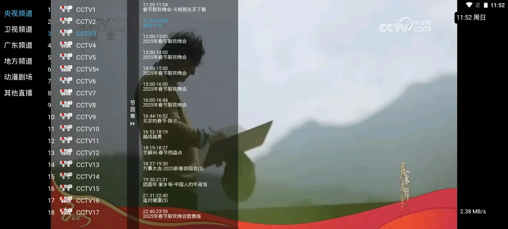

# 原因
1. 定位自家使用
2. 曾开通电信IPTV，想看的台却没有
3. 稳定的IPTV直播源太难有了，一失效或者播放卡顿，就老是兴师问罪
4. CCTV_Viewer挺好的，但是不符合操作习惯，而且节目源无法自制

# 界面

# 功能说明
1. 单按确认键弹出节目列表，长按确认键或者菜单键弹出设置列表
2. 列表配置-列表订阅，本项目不提供节目来源，格式参考channels.json
3. 列表配置-EPG订阅，内置EPG订阅源，不想另行设置则点击确定即可
4. 列表配置-台标订阅，本项目不提供台标来源，压缩包名称必须为logo.zip
5. 其他设置-启动页图片，内置每日必应壁纸订阅源，不想另行设置则点击确定即可

# 其他说明
1. 只支持5.0及以上
2. APP过大的原因是，内含有32位和64位的X5内核，以及支持arm64-v8a、x86、armeabi-v7a、x86_64
3. 不开源，不收集任何隐私

## 目前问题
1. 使用uniapp x开发，弹出列表、切换列表会出现卡顿问题，配置越低越明显
2. 节目列表出现闪烁问题，使用canvas渲染，因为并非一次性渲染全部内容，而是切换一次就重新渲染一次

## 测试机型
荣耀V10、DBB3 PRO、TCL电视、夜神模拟器

## 参考
1. CCTV_Viewer
2. mytv-android
3. 酷9
